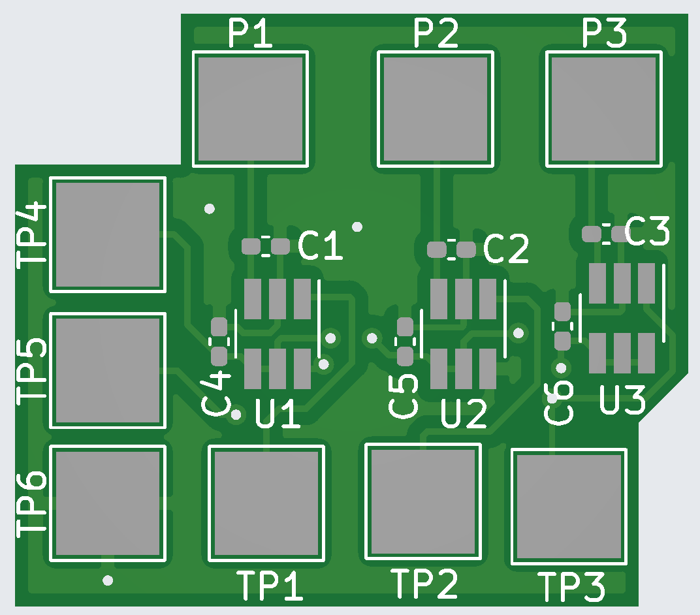
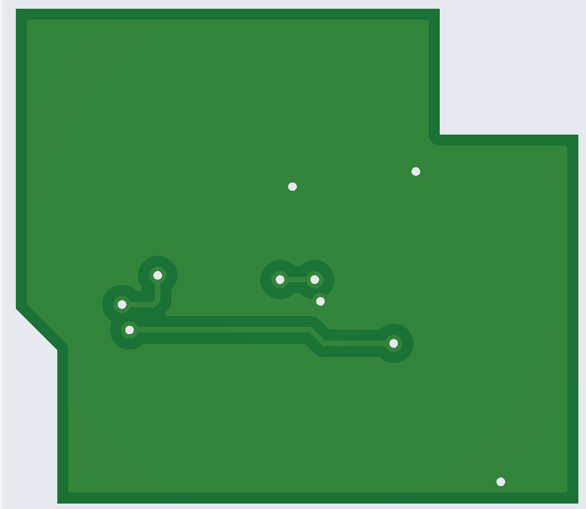

# FPIPSTouchSensorAddOn
an optional, semi-customizable board to add touch sensors to a funnyplaying AGB IPS screen ribbon, instead of using the SEL+R/L button combination

You can think of the touch sensors connected to P1 and P2 as "momentary" buttons, where as the touch sesnor on P3 act as a "toggle" switch(tap once to enable, tap again to disable)

I havent yet built this, I cannot verify that it actually works as intended, for building and installation I suggest referring to the schematic file, as it contains some notes.

## BOM

| RefDes | Part | Spec Sheet|
|--------|-----|------------|
|U1,U2,U3|TTP223-ba6| https://datasheet.lcsc.com/szlcsc/TTP223-BA6_C80757.pdf |
|C1,C2,C3|22pF Capacitor| N/A |
|C4,C5,C6|0.1uF Capacitor| N/A|

## Connections
| Pad |  Destination  |
|-----|---------------|
| TP1 | L On FP Ribbon|
| TP2 | R On FP Ribbon|
| TP3 | GND On FP Ribbon|
| TP4 | 3.3v on AGB |
| TP5 | Select on FP Ribbon(optinonally tie to ground if you dont populate U3, C3, and C6 |
| TP6 | GND On FP Ribbon |
| P1 | Touch Sensor for decreasing brightness |
| P2 | Touch Sensor for increasing brightness |
| P3 | Touch sensor for select(optional, only needed if you populate U3, C3, and C6) |

## Credits
Zekfoo for catching some mistakes I made during the original board design process and for a third touch sensor(optinal) for the SEL pad
